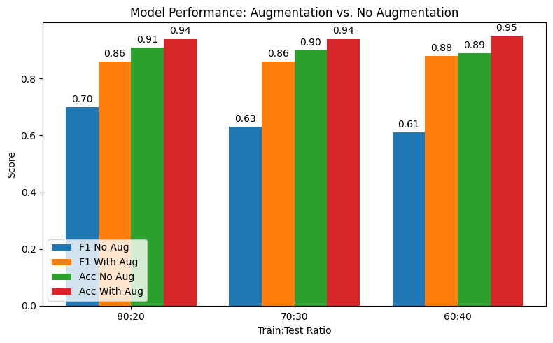
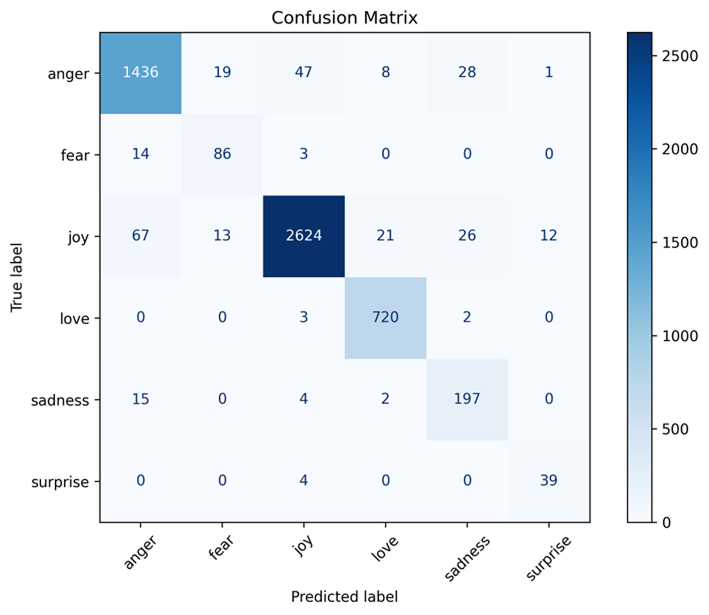
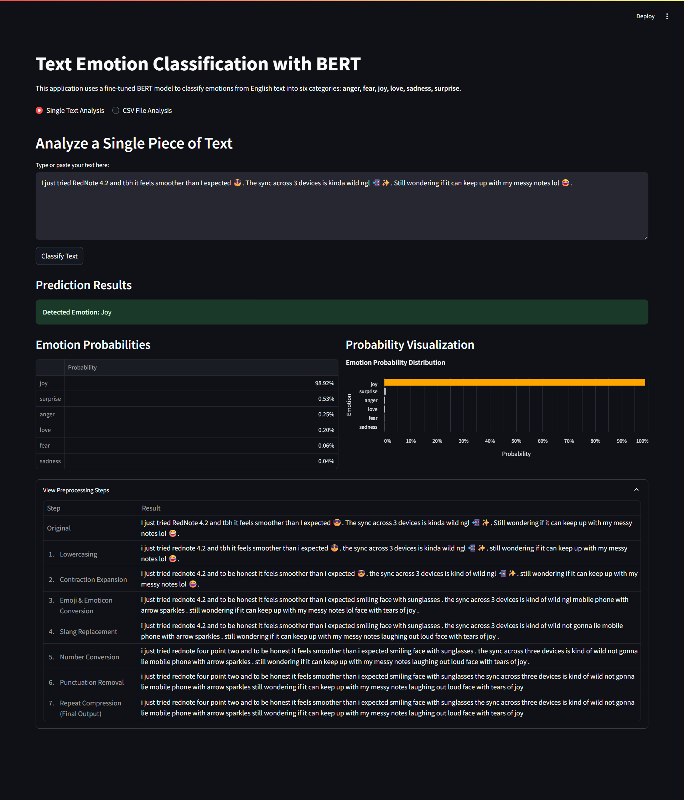
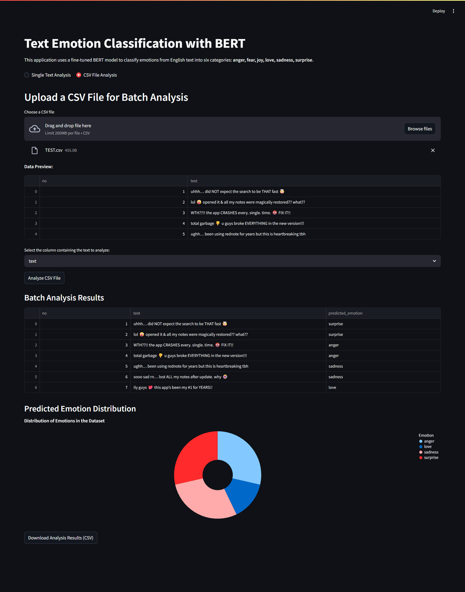

# Emotion Classification on RedNote App Reviews using BERT

This repository contains a fine-tuned BERT model and a Streamlit web application for **emotion classification** on user reviews of the RedNote (Xiaohongshu) mobile application.  
The project was originally developed as part of my undergraduate thesis and later adapted into an interactive demo.

---

## 🔍 Project Overview
- **Goal:** Automatically classify user emotions in app reviews, going beyond simple sentiment polarity.  
- **Dataset:** 13,477 English reviews collected from Google Play Store.  
- **Labels:** Six primary emotions (Joy, Anger, Sadness, Fear, Love, Surprise) based on *Parrott’s emotion hierarchy*.  
- **Challenge:** Highly imbalanced dataset.  
- **Solution:** Applied **data augmentation** (back-translation and contextual word-embedding substitution) to balance emotion categories.  
- **Model:** Fine-tuned `bert-base-uncased` with hyperparameter tuning (8 epochs, learning rate 3e-5).  
- **Performance:** Achieved robust classification with F1 > 0.90 across most emotions.  

---

## ⚙️ Installation & Usage

Clone the repository:
```bash
git clone https://github.com/DamdyJ/nlp-emotion-classifier.git
cd nlp-emotion-classifier
```

Install dependencies:
```bash
pip install -r requirements.txt
```

Run the Streamlit app:
```bash
streamlit run app.py
```

The app provides two modes:
1. **Single Review Analysis** – Input one review text and get predicted emotion scores.  
2. **Bulk CSV Analysis** – Upload a CSV file of reviews and get distribution of emotions.  

---

## 📊 Experiments & Results

### Data Augmentation & Splitting Scenarios
From thesis experiments:
- Without augmentation, minority emotions (fear, love, surprise) were underrepresented.
- With augmentation, performance improved significantly across all train:test ratios (80:20, 70:30, 60:40).


**Model Performance With and Without Augmentation (by Data Split):**


### Preprocessing Pipeline
Steps included:
- Emoji & emoticon → descriptive text  
- Slang & contractions → normalized  
- Text lowercasing & cleaning  

This ensured emotional signals were preserved and understood by BERT.

### Model Performance
Evaluation metrics from confusion matrices and F1-scores:

| Emotion   | Precision | Recall | F1-score |
|-----------|-----------|--------|----------|
| Joy       | 0.92      | 0.91   | 0.91     |
| Anger     | 0.91      | 0.90   | 0.90     |
| Sadness   | 0.93      | 0.92   | 0.92     |
| Fear      | 0.90      | 0.89   | 0.90     |
| Love      | 0.91      | 0.90   | 0.91     |
| Surprise  | 0.92      | 0.91   | 0.91     |

**Confusion Matrix:**  


---

## 🖼️ Application Demo

**Single Review Analysis**  
  

**CSV Analysis**  
  

---

## 📂 Repository Structure
```
├── bert-emotion-model/ 
├── images/             
├── .gitignore
├── app.py 
├── README.md   
└── requirements.txt
```

---

## 📜 License
This repository is for academic and showcase purposes only.  
You are free to use and adapt the code with proper attribution.  

---

## 🙋 Author
Developed by **Damdy Junaedi** (2025).  
